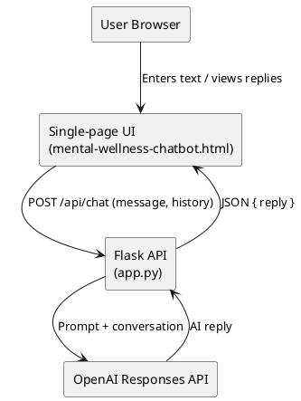
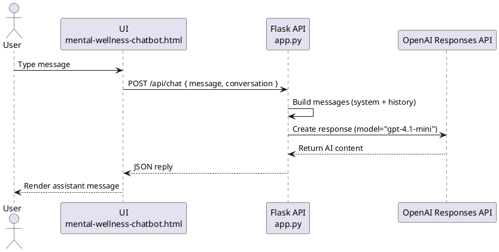

# System Architecture

This project is a lightweight Flask-based mental wellness chatbot with a single-page frontend. The system relies on OpenAI's Responses API to deliver empathetic replies. The diagrams below capture the component layout and request flow.

## Component overview
```mermaid
flowchart LR
    User[User browser]\n    UI[Single-page UI\n(mental-wellness-chatbot.html)]
    API[Flask API\n(app.py)]
    OpenAI[OpenAI Responses API]

    User -->|Inputs message| UI
    UI -->|POST /api/chat| API
    API -->|Structured prompt\n + conversation| OpenAI
    OpenAI -->|AI reply| API
    API -->|JSON response| UI
```

**Notes**
- The UI is a static HTML page that handles message composition, renders the chat history, and calls the backend endpoint via `fetch`.
- The Flask API injects a trauma-informed system prompt, merges prior turns, and relays the request to the OpenAI Responses API.
- Responses are returned as JSON and rendered in the UI conversation view.

## StarUML-friendly UML (component + sequence)
The following PlantUML snippets can be imported into StarUML to visualize the architecture and runtime behavior.

### Component diagram


### Sequence diagram


### Key responsibilities
- **UI**: Presents the chat experience with calming visuals, captures user input, and sends asynchronous requests to `/api/chat`.
- **API**: Validates requests, prepares the system prompt and conversation, invokes the OpenAI client, and returns structured JSON.
- **OpenAI Responses API**: Generates empathetic replies based on the provided prompt and conversation context.
