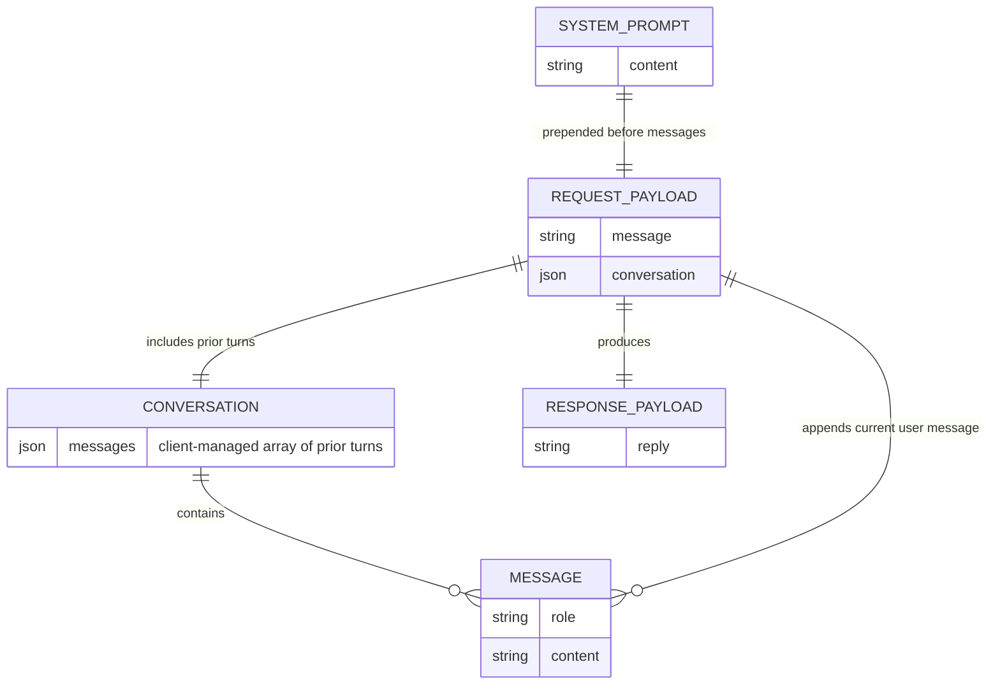

# Data model and ER diagram

This application does not persist data in a database, but the request/response payloads still follow a consistent structure. The diagram below captures the relationships between the client-managed conversation history, the payload sent to `/api/chat`, and the assistant response returned by the Flask API.

**Legend**
- `CONVERSATION` represents the ordered array of `{ role, content }` objects the frontend stores and resends on each request.
- `SYSTEM_PROMPT` is injected by the backend before forwarding the message list to OpenAI.
- `REQUEST_PAYLOAD` mirrors the JSON body accepted by `POST /api/chat` in `app.py`.
- `RESPONSE_PAYLOAD` mirrors the JSON body returned by the API (`{ "reply": "..." }`).
- `MESSAGE` denotes a single chat turn used within the conversation history and current request.
